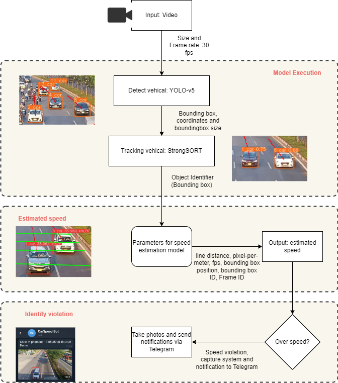
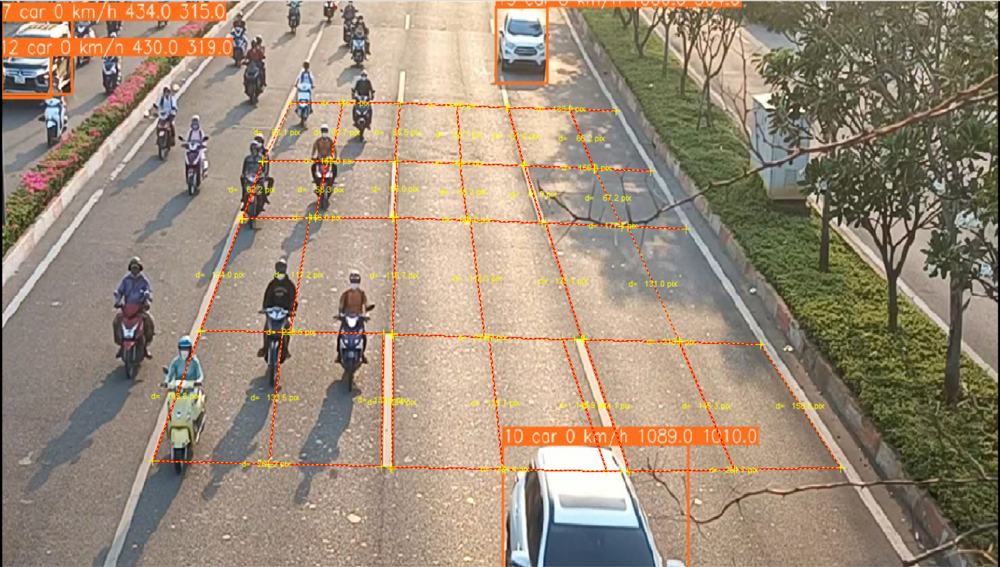
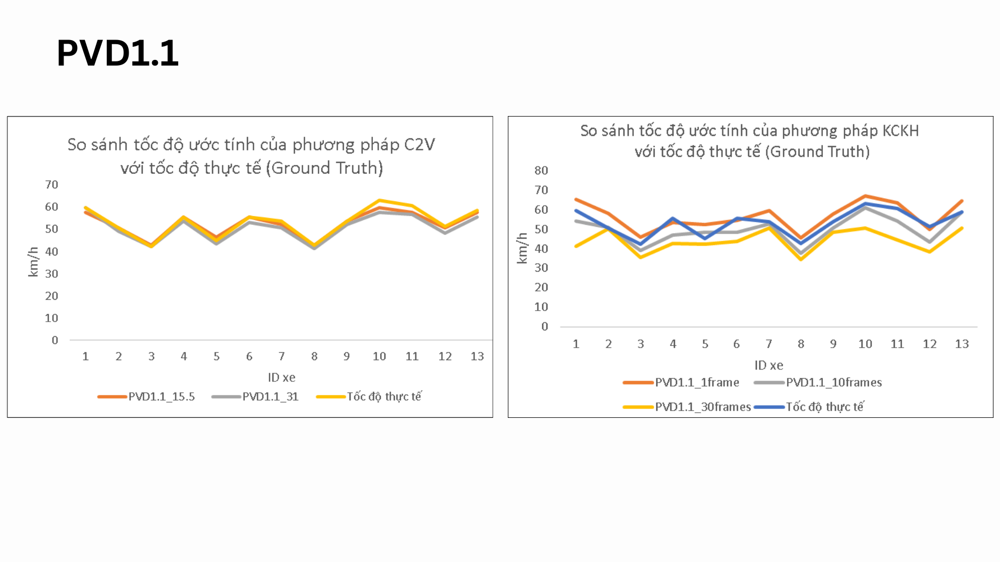
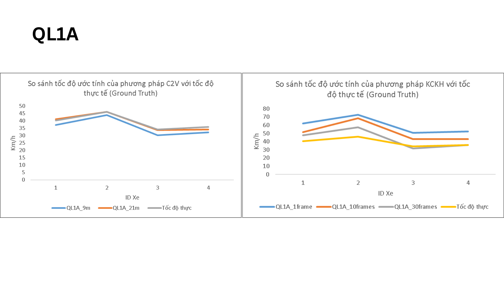
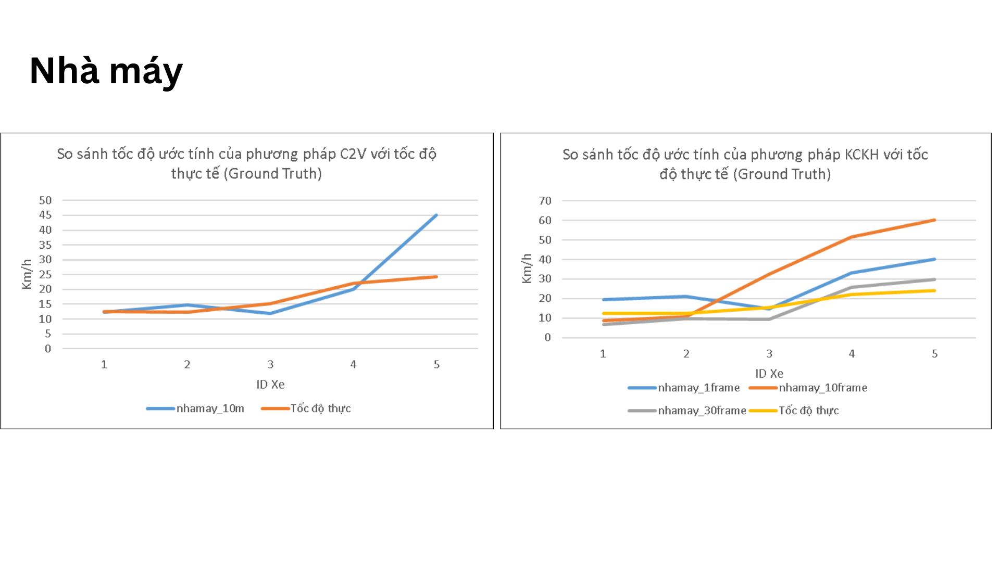

# Vehicle Speed Calculation using YOLOV and StrongSORT

## Introduction
This project focuses on creating a model for estimating vehicle speeds based on video footage. The **YOLOV** model is employed to **detect vehicles**, while **StrongSORT** is used for** vehicle tracking**. The speed calculation is carried out using the formula **v = s/t, where v represents velocity, s denotes distance, and t stands for time.
**

## Method

## Calibration Camera

## Result Demo

[Download Demo Video (carspeed.mp4)](carspeed.mp4)

## Result comparision
I use many methods to evaluate based on ground truth to come up with the best calibration solution for each camera.

